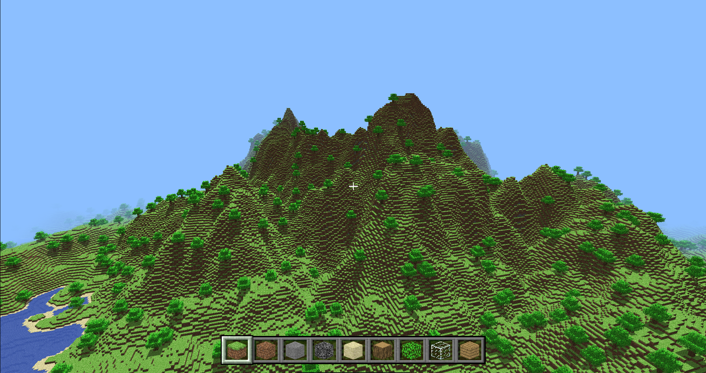
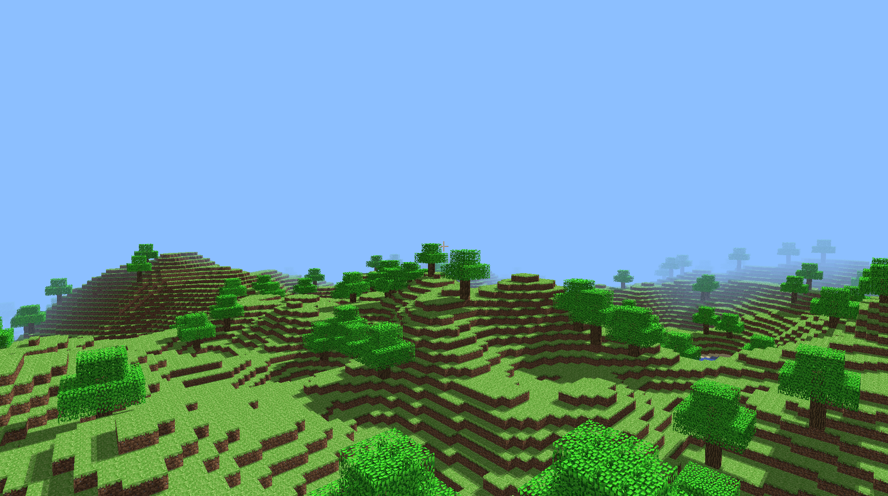

## Welcome
This is my first c++ project. I've started this to learn c++ and improve my
OpenGL skills.

Feel free to comment on what you don't like or like, and I'll try to improve.

Currently, been working on it in and out for ~5 months when I find free time.

## The Game
The game is basically a clone of Minecraft classic but with infinite worlds and
shadow mapping. 

There are still a few features I want to add like swimming, bug/crash fixes, UI,
an inventory system, day/night cycle and the sun.

## Current Features

- Infinite world generation
- Threaded chunk generation
- Placing blocks
- Breaking blocks
- Transparency sorting
- Water Animation using texture change
- Collision system
- "Physics"
- Sneaking using shift
- F11 for fullscreen (can't get out of fullscreen for now)
- Shadows using shadow maps from the sun
- Tree generation

## Known Issues

- Sometimes the tree leaves don't get added until chunk is updated
- Sneaking on chunk edges may not work properly all the time

## Features to implement

- Water shader
- Inventory system (basically a creative menu)
- Saving and loading Worlds
- More varied terrain generation
- Flowers
- Ores
- Caves
- Ambient occlusion
- Deferred rendering
- Swimming
- In-water post-processing effect
- Sun/moon
- Day/night cycle
- Clouds
- Slabs

Feel free to leave more suggestions (please be reasonable)

## Building

git clone --recurse-submodules https://github.com/Vodkasas/CraftMine.git

## Linux/Unix

Using CMake:

Open terminal and cd to the CraftMine folder, create a folder called "build" and cd there
Now type in:

    cmake ..
    make

Now your executable should be in the build folder

## Windows

Using Cmake:

Open up cmd and cd to the CraftMine folder location.
Type in:

    cmake .
    cmake --build . --config Release

This should build the project in CraftMine/Release and you should see an exe file to run the game.

